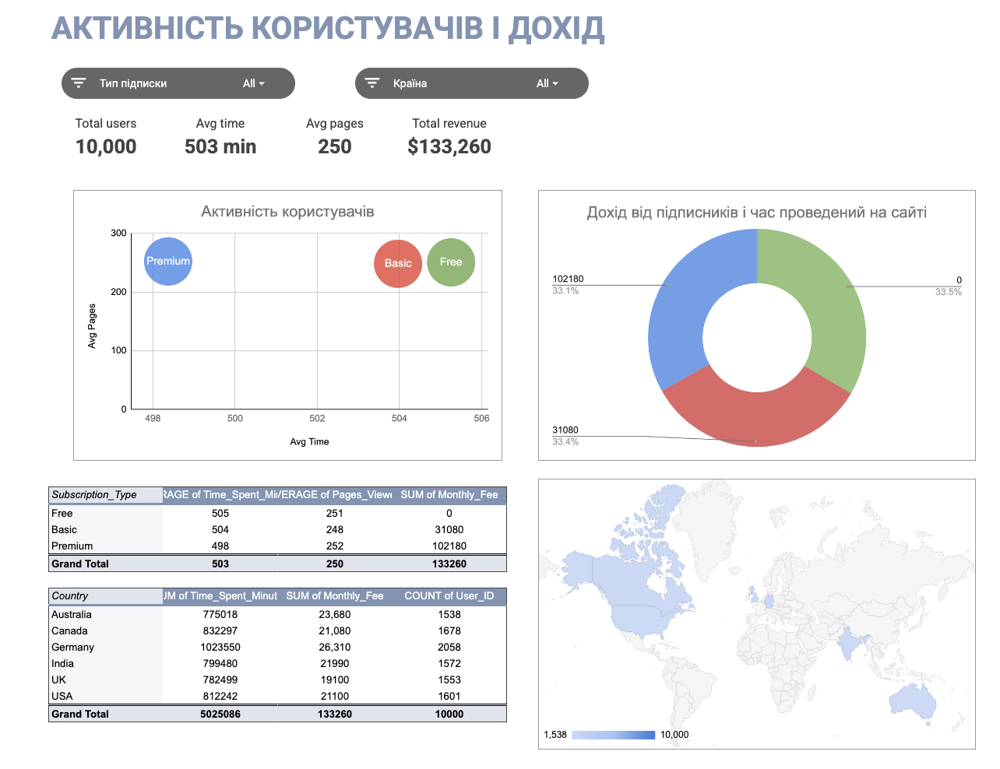
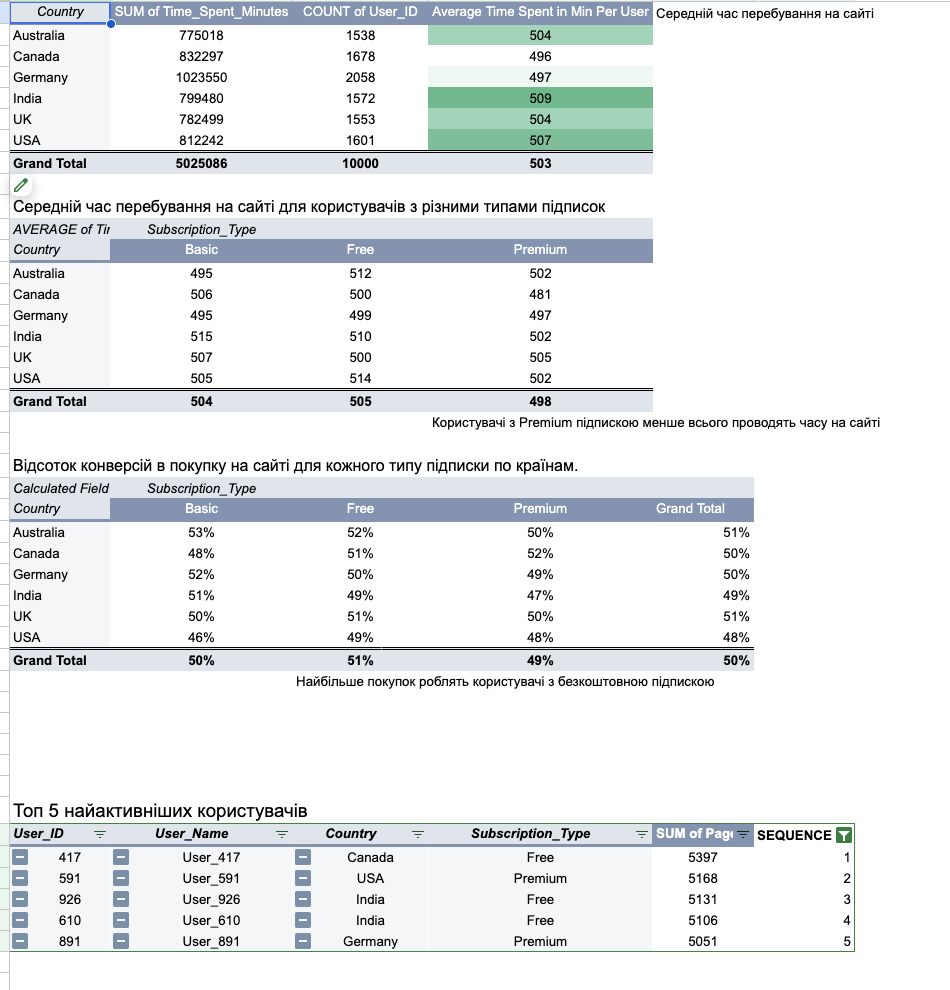

# 📊 User Activity Analysis

## 🎯 Goal
Analyze user behavior on the website and understand how subscription affects activity and revenue.

---

## 📊 Main Results

- Total users: 10,000  
- Average time on site: ~503 min  
- Total revenue: $133,260  

---

## 🔍 Key Insights

- Users spend ~500 min on the site (almost same in all countries)  
- Free users are **very active**  
- Premium users spend **a bit less time**  

👉 Conversion:
- Free: ~51%  
- Basic: ~50%  
- Premium: ~49%  

📌 Free users convert the most

---

## 🏆 Top Users

Top 5 users were found by number of pages viewed.

---

## 📈 Dashboard

  

---

## 📊 Tables

  

---

## 🧠 What I used

- Google Sheets  
- Pivot tables  
- VLOOKUP  
- Calculated fields  

---

## 💡 Conclusion

- Free users are active and convert well  
- Premium users need better value  
- Opportunity: convert Free → Premium
